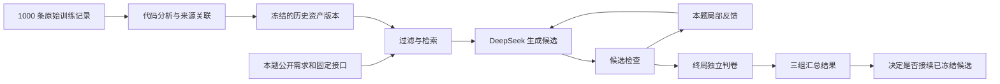

# 当前两组件方法与证据边界

2026-09-16 14:17 执行范围更新：原 200 题四组已停止并保留结果；筛选完成后已启动
[100 题四组实验](../experiments/history_feedback100/README.md)。四组各 100 题、空知识库，
每题 10 个候选、64 次总调用，沿用两层反馈方法和华硕本机量化模型，没有应用已取消的提速改造。
以下 200 题启动说明为此前记录。

2026-09-16 执行范围更新：保留新版 Full 当前进度，同时重新启动新版 NoAssets、NoFeedback、Neither，
各自 200 题、空历史库、同题序和预算。详见 [新版消融实验](../experiments/history_feedback200_ablation/README.md)。

2026-09-15 当前采用 [两层反馈方法](method_history_feedback/README.md)，实现为
`method_history_feedback/two_level.py`。第一层用本题真实测试诊断指导下一次代码生成，识别重复失败，
必要时重新构造或退回较好的候选；第二层从同题同阶段的失败→通过转换提炼条件、写法、例外和验证建议，
经过来源核对与模型复核，在题目结束后提供给后续题。知识不修改模型权重。

实验入口为 [200 题新版 Full](../experiments/history_feedback200_full/README.md)，华硕本机
Qwen3.8-27B Q4_K_M，每题 10 个候选、64 次总调用，只做编译和运行测试。本轮是修改方法后的
探索性重跑，旧版四组结果不与本轮混算。下文保留此前协议，不作为当前启动依据。

2026-09-14 最新范围：用户已停止旧 repair-policy 实验，转向
[method_history_feedback 在线方法](method_history_feedback/README.md)。新的四组从各自空知识库起步，
固定同一题序，在题后整理知识供后续题使用；每题最多 20 个代码候选、64 次总调用（用户已确认）。
四组编排与独立判卷见 [实验协议](../experiments/history_feedback117_study/README.md)。
旧实验停于 467/468，完整保留结果和中断现场；不恢复旧任务，也不接续 DeepSeek。

2026-09-14 17:36 最新执行范围：按用户要求，DeepSeek Flash 接续队列已停止并 mask，生成调用为 0。当前 Qwen 四组完成全部 468 项、汇总和审计后结束本轮，不自动接续其他模型或方法版本；后续方法论更新另行实施。

2026-09-14 更新：用户已授权新的完整 117 题 Qwen3.8-27B 实验，每任务每组最多 20 次。当前改进实现为 [历史修改策略](repair_policy.py) 和 [三组工作流](policy_workflow.py)，协议见 [Qwen 117 题实验](../experiments/repair_policy117_study/README.md)。它从全部原训练任务的成功程序与成功/失败历史轨迹学习状态条件下的修改选择，并提供由源修改抽象和当前代码唯一绑定的候选补丁。资产仍在测试前冻结；新实验不恢复旧 v11 或重置旧预算。下文保留的是此前五次、45 题版本的实现和证据，不能用作新实验的模型、次数或任务数量配置。

2026-09-14 后续更新：用户在查看三组中途结果后要求补充 [Neither 第四组](../experiments/repair_policy117_neither_20260914/README.md)，同时关闭历史资产与模型可见的本题反馈。新增完整 117 题，从空代码开始，仍最多 20 次，与原三组合计 468 项。原三组冻结输入及预算保持；第四组单独记录补充协议、同题配对比较及执行时序限制。

此前版本由历史软件资产和本题反馈两个组件组成。历史资产只来自全部 1000 条原始 ST 训练记录；测试时资产冻结，本题反馈只用于本题后续尝试。下文历史正式协议以 [三组消融协议](../experiments/historical_assets_study/CURRENT_PROTOCOL.md) 为准，运行和结果以对应目录的原始收据、报告及已核对的进程为准。

本文描述已实现机制。知识图谱节点数、源码检查通过或一次中途通过数不能当作 RSI 有效性的证据。训练留出和额外训练练习继续保持取消；第四组已按用户后续授权单独新增。

2026-09-13 的[训练来源一致性审查](../experiments/historical_assets_study/SOURCE_CONSISTENCY_REVIEW.md)已在华硕独立后台启动，逐条检查原提炼候选的机制、前提、义务和边界，并保留原调用费用。审查只能修订或弃用训练候选，不向资产写入测试反馈；经审查的候选尚未用于三组测试。配套的新建库和评测运行层已通过 125 项远程检查，等待实际审查结束及独立审计。

2026-09-13 另行实现了[由训练提炼知识作为生成参考的候选分支](INDUCED_KNOWLEDGE_REFERENCE.md)。该分支将条件规则、模板、状态机等知识完整投影到生成上下文，默认检索只使用公开需求；另有显式[本题诊断参与检索的候选](../experiments/historical_assets_study/DIAGNOSTIC_KNOWLEDGE_QUERY.md)，关闭反馈时也关闭诊断检索。两者均尚未用于正式 45 题评测。[induction v4 已完成真实提炼及来源、用量审计](../experiments/historical_assets_study/INDUCTION_V4_RESULTS.md)，得到 15 条候选；完整内容审查和已知复位例外遗漏仍待处理，尚未发布新测试库。下文的 331 条代码切片及 v9–v11 描述仍对应原冻结实验，不应与新知识分支混淆。

## 1. 历史资产学到了什么

资产提炼器读取原始成功程序、相邻修复前后的代码和已经存在的验证记录。1000 个训练任务保留为案例目录，其中记录了 266 条历史修复转换。整条轨迹最终成功不代表其中每次修改都成功：修复资产的来源要求紧邻修改后的编译、运行测试和形式检查记录均通过。

代码提炼保留赋值顺序、分支优先级、类型、存储方向和初值，把变量名改成角色。按输出做依赖切片，并在当前候选中纳入影响后续扫描的状态更新。不支持的源语法会被排除，不把删去关键语句的片段标成完整实现。当前这类资产有 331 条；它们是训练代码的抽象参考，不能当成 331 个新生成成功任务。

每条资产关联以下原始证据：

| 内容 | 表示与作用 |
|---|---|
| 修复前后程序 | 完整的来源输出切片、语法树及代码哈希，用于检查实际变化 |
| 输入、输出和内部状态 | 带类型、存储方向、初值及原始名称含义的角色表 |
| 扫描依赖 | 入口引用、执行顺序、分支优先级和保留的后续状态 |
| 需求及属性 | 原始需求 ID、文字、形式属性与来源记录哈希；v11 补齐关联 |
| 历史失败 | 真实输出差异或形式检查报告中的条件，保留其原有证据级别 |
| 紧邻修复后检查 | 原始阶段状态和回执绑定；不替代目标任务的验证 |

来源之间已知的任务组关系用于过滤和计数。上游依赖谱系仍不完整，多个任务 ID 不等于已经证明相互独立。一次整体修复可能同时修改多个输出，不能把成功唯一归因于某个局部编辑。

相关实现为 [repair_assets.py](repair_assets.py)、[scan_state.py](scan_state.py) 和 [source_contract_links.py](source_contract_links.py)。当前学习使用确定性的源代码分析和证据关联，没有额外训练模型调用或 PLC 回放。

## 2. 知识图谱与检索分别做什么

关系图记录修复转换、代码切片、角色、状态依赖及原始需求之间的关联。v11 新增的需求节点和关联边来自原始训练合同，并绑定对应 repair ID。图的作用目前是保存可追踪的关系；尚未实现并验证 OWL 本体推理、自动语义绑定或图上组合规划。

生成时仍由 [repair_retrieval.py](repair_retrieval.py) 执行类型与来源过滤、BM25 排序和字符预算控制。查询读取本题公开需求及固定接口；只有反馈开启并出现实际失败时，才把本题失败阶段用于检索。unknown 不是已确认的程序错误。NoAssets 不返回历史参考，NoFeedback 的检索不读取本题诊断。

来源程序依赖的 BOOL 输入在 v10/v11 中可以作为待满足的任务条件提供给模型，但必须由本题公开需求或允许的内部状态建立对应。系统不替目标任务增加外部端口，不默默改变数值类型，也不宣称这种语义对应已经完成。无法建立对应时，模型应忽略该参考。

v9 及其后续候选只向模型展示成功修复后的代码，修复前的代码仍在冻结库中。v11 优先显示被选历史失败所引用的输出需求解释；这些解释须一起放入原有来源上下文预算，否则省略该来源。原始需求、代码和状态不会被测试答案替换。实际采用哪一版，以该轮冻结库与源代码为准。

## 3. 本题反馈怎样辅助生成

[guarded_workflow.py](guarded_workflow.py) 从空程序开始生成候选，并把候选送交共同的检查流程。反馈开启时，后续生成可看到当前候选绑定的错误或未确定结果、该题此前尝试以及相应修复指令。反馈关闭时仍执行检查和共同停止规则，但模型看不到这些诊断；它只能保留该题自己生成的先前程序及允许的历史资产。

每题每组最多五个候选、五次生成调用，成功后按共同规则停止。模型为既定 DeepSeek Flash 官方路由，只有原有余额不足条件才回退 TeamRouter。所有实际响应及 token 用量保留。只有最终程序的编译、运行测试和配置形式检查都通过，才计成功；失败与未知分别报告。通过范围限于这些配置检查。

关闭资产时切断 K 到 R 的输入，关闭反馈时切断 F 到 G 的输入。F 没有到 L 或 K 的写入路径。下一题从自己的空程序和公开需求开始。

## 4. 版本迭代与尚未证明的 RSI 主张

当前研究允许根据整体比较结果修订提炼算法，并重新从同一批原始训练记录构建候选版本。每个候选独立冻结；当前轮结束并完成原始证据审计后，控制器按既定组件通过数与 token 条件决定是否接续。旧版失败、未知、预算和原始结果不删除，也不重置在途任务。

这一流程已经实现训练资产的版本化重构及测试中的局部反馈修复。算法修订仍由研究过程提出；控制器不会自动发明新提炼算法。当前也没有执行“用资产完成新的训练练习，再将练习结果积累为新资产”的闭环，因为用户已经取消额外训练练习和训练内验证。模型权重未更新。

因此，尚不能将已有实现表述为已证明自主递归学习、图推理有效或递归优于同预算静态资产。论文的 RSI 核心贡献仍需要历史资产在共同反馈条件之外产生可复核增益，且需区分版本重构、资产使用和真正新增训练经验的贡献。当前研究目标尚未达到。

测试集的代码、答案、轨迹及错误条目不能成为跨题资产。整体测试结果可以影响探索性的算法设计和接续决定；同一批 45 题已多次使用，不能把这些结果称为未见任务上的独立泛化证据。

## 5. 三组消融怎样判断组件作用

| 组别 | 历史资产 | 本题反馈 | 主要比较 |
|---|---|---|---|
| Full | 开启 | 开启 | 两个比较的共同参照 |
| NoAssets | 关闭 | 开启 | Full−NoAssets：历史资产的增量 |
| NoFeedback | 开启 | 关闭 | Full−NoFeedback：本题反馈的增量 |

每版均为同一批 45 题、135 个任务运行。版本数不是消融组数，不运行两个组件都关闭的第四组。关闭反馈组仍接受与其他组相同的验证。

结果按题配对统计通过数、反向结果、失败/未知、调用数和输入/输出 token，报告不确定性及两项主要比较。还按生成前是否实际拿到资产进行分层，检查同输入对照的重复运行差异。前后版本的对照组也会有模型随机波动，不能把所有分数变化都归于资产修改。

只有 135 项完整判卷、实际模型用量与原始证据审计完成后，才形成一轮结论。若历史资产未增加成功数、仍增加 token 或证据不足，应保留反例并继续研究，不能用资产覆盖率或源码测试替代生成收益。最新完整判断见 [研究记录](../experiments/historical_assets_study/README.md)，固定分析规则见 [组件分析方案](../experiments/historical_assets_study/COMPONENT_ANALYSIS_PLAN.md)。

## 6. 当前文件与执行入口

资产构建及候选准备见 [历史资产研究目录](../experiments/historical_assets_study/README.md)；v11 的实际改动、预检和服务路径见 [来源需求关联候选](../experiments/historical_assets_study/SOURCE_CONTRACT_LINK_CANDIDATE.md)。后台观察入口见 [结果观察说明](../experiments/historical_assets_study/RESULT_OBSERVER.md)。

`training.train` 的静态基线入口、`experiments/rsi_study` 的旧训练练习协议，以及旧版 direct-all 启动命令仍为历史复现保留。它们不应被当成当前后台服务的重启命令。现有运行使用各自的冻结目录和独立预算；恢复工作时先核对实际 PID、根目录和状态。
