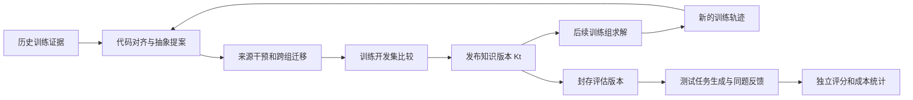

# 面向 PLC 扫描语义的可执行知识库学习：方法设计稿

当前实现与未完成事项统一见 [两组件方法与证据边界](CURRENT_METHOD.md)。本设计稿中的局部干预、自动语义适用性判断、图组合规划及新训练练习闭环不能据实现了部分资产提炼就宣称已经实现或有效；本稿保留为研究假设和历史设计。

当前实施进展见 [三组冻结实验](../experiments/historical_assets_study/README.md) 和 [训练资产改进候选](../experiments/historical_assets_study/CANDIDATE_TRANSITION_V2.md)。用户已取消下文的训练划分、练习及额外验证，当前直接使用全部 1000 条原始历史建库。下文保留原始设计假设；已实现的有界结构分析、尚未完成的语义适用性证明及递归收益必须分别陈述。

日期：2026-09-12。状态：设计，尚未实现和验证。本轮只重新设计历史知识沉淀，没有恢复已停止的消融、调用生成模型、修改评价器或发布训练资产。本文档是下一版方法的设计入口；旧实现及其实验记录保留。

## 1. 核心问题与拟检验的贡献

研究问题是：固定生成模型及本题反馈流程后，能否从训练历史中学出可迁移的程序知识，使后续不同任务更容易在限定预算内生成通过检查的 ST 程序？本文研究的 RSI 限定为 harness 外部知识库的递归更新，模型权重不变。

当前方法的不足不只是知识表示不够复杂。现有五字段文字技能、来源绑定、条件检查草案及版本准入已经覆盖了“提炼—验证—发布”的流程框架，但没有建立足够的跨任务有效资产。旧完整方法在首请求预检中仅对 3/45 题检索到代码案例；历史修复材料主要在本题失败后出现。资产开关打开不代表产生了知识干预。已停止的消融只有 132/180 份完成记录，不能给出完整组间效果，更不能证明整个历史学习方向无效。

下一版把主要研究对象具体化为“带适用条件、状态转换和证据的程序抽象”。拟检验的贡献有三项：

1. 从真实训练程序及修复转换中归纳保留类型、变量角色和跨扫描状态含义的程序抽象，并通过局部干预与跨组迁移检查限制过度归纳。
2. 使用语义关系组织抽象的前提、依赖、冲突与可组合操作，使知识能够参与首次程序构造及后续修复；实际作用由使用记录和对应对照检验。
3. 让已发布知识参与下一轮训练求解，根据新训练证据更新知识的内容和适用边界，验证递归更新是否优于同预算的静态知识库。

以上是待检验的研究贡献，不能预先写成方法已有效。使用本体、图谱、技能文件、版本控制或形式验证，本身都不足以构成这些贡献。

## 2. 与最接近研究的关系

本轮核对了以下原始论文或正式出版页面。这里用于确定设计边界，不是穷尽式新颖性调查。

| 工作 | 已有机制 | 本设计必须进一步检验的差异 |
|---|---|---|
| [ExpeL，AAAI 2024](https://ojs.aaai.org/index.php/AAAI/article/view/29936) | 从训练经验提炼自然语言洞见，并在推理时使用经验和洞见 | 增加 PLC 程序级条件、可实例化操作及逐条迁移证据；仅总结经验不构成差异 |
| [Stitch，POPL 2023](https://mlb2251.github.io/stitch.pdf) | 从程序语料学习共享函数抽象，以库学习和语料压缩为核心 | 借鉴程序抽象学习；额外处理命令式 ST 的状态、副作用和时序，目标以生成效果与总成本衡量，不能将压缩率当成生成收益 |
| [MemSkill，arXiv:2602.02474v2](https://arxiv.org/abs/2602.02474v2) | 学习记忆技能选择，并通过设计器修改记忆操作技能 | 本设计学习的是有行为合同的 PLC 构造与修复知识，必须证明其内容层面的迁移作用 |
| [EvoSkill，arXiv:2603.02766](https://arxiv.org/abs/2603.02766) | 从执行失败发现和改进技能，并按验证集表现选择 | “失败分析＋技能演化＋验证准入”已有先例，不能单独作为本文贡献 |
| [Trace2Skill，arXiv:2603.25158v5](https://arxiv.org/abs/2603.25158v5) | 从多条轨迹提出技能修改，归纳合并为可复用技能 | 需要超出轨迹归纳文本，研究可机器检查的适用性和程序操作 |
| [SkillCAT，arXiv:2606.13317v2](https://arxiv.org/abs/2606.13317v2) | 对比同题成功/失败轨迹、回放候选修改、按技能拓扑选择上下文 | 与本设计很接近；对比、回放和拓扑路由都不是单独的新点。需要检验不同训练组上的 PLC 语义迁移及可执行合同，而非仅在来源题克隆上回放 |
| [同名 Trace2Skill 的 EDA 工作，arXiv:2605.21810](https://arxiv.org/html/2605.21810v1) | 在当前目标任务内用验证反馈演化技能，指导后续 RTL 搜索和修复 | 本设计严格将测试任务反馈留在题内，跨题资产更新只使用训练任务；两篇 Trace2Skill 是不同论文 |
| [PLC 知识图谱辅助生成，CAICE 2026](https://doi.org/10.1145/3804601.3804649) | 将系统拓扑和历史控制逻辑模板组织为图，用于辅助生成代码框架 | “历史 PLC 模板＋图检索”已经存在；需研究历史知识的学习边界、训练侧递归更新和完整可执行候选的独立验证 |

Stitch 提供程序抽象学习的基础方向，SkillCAT 和 PLC 图谱工作是需要正面比较的竞争解释。不能宣称上述工作都没有来源验证、因果分析或技能组合。进入论文正式相关工作前，还需逐节核对实现和实验协议；预印本不应标成已正式录用，书目信息仍需作者人工校对。

## 3. 明确人工设计和系统学习的边界

可重复的学习实验需要先冻结人工提供的能力，再测量从历史中新增的能力。

| 人工固定、所有适用对照共享 | 由训练历史归纳、作为学习结果 |
|---|---|
| ST 解析、类型系统、扫描步的表示方式、变量作用域规则 | 哪些带类型的代码结构能被归并为同一种行为机制 |
| 有界的操作语法，如替换表达式、调整受保护分支、引入局部状态、组合受约束片段 | 具体操作主体、参数角色、适用前提及不适用边界 |
| 来源检查、验证器、预算、版本格式与准入流程 | 哪些资产被支持、反驳、专化、合并或退役 |
| 固定的检索与候选组合算法 | 资产内容、语义索引、依赖关系和训练侧使用效果统计 |

初版不同时让系统修改提示词、验证器、路由算法和知识内容，以免无法定位收益来源。领域本体的顶层词汇先固定；本轮学习对象是其下的机制实例、约束和操作。后续若研究本体结构的自动扩充，应作为独立变量。

已有人工布尔规则可以保留为工程对照。若它直接把当前公开合同中的等式翻译成代码，就不能把这种能力计为历史学习；必须与“直接合同编译器”比较。

## 4. 一条资产具体保存什么

每条资产用一个参数化的语义对象表示。自然语言说明、图节点与技能文件均由同一对象导出，避免维护三套相互矛盾的知识。

| 字段 | 含义 | 检查方式 |
|---|---|---|
| `roles` | 输入、输出、保留状态、临时量、配置参数及其类型和单位 | 类型和作用域检查；变量名不能替代语义角色 |
| `guard` | 可机器检查的适用条件 | 对当前公开需求和候选程序得到 true / false / unknown |
| `transition` | 当前扫描输入、旧状态与下一状态/输出之间的关系 | 保留读取版本、更新顺序、复位优先级和数值语义 |
| `operation` | 参数化构造模板或受约束程序变换 | 在受支持的 ST AST 子集上实例化；不做模糊字符串替换 |
| `footprint` | 读取、写入、引入的状态、调用副作用和别名限制 | 组合时检查写冲突、状态所有权与依赖 |
| `obligations` | 适用后需要满足的局部性质及回归要求 | 来源回放、迁移检查及完整候选验证；不能修改评测 oracle |
| `evidence` | 来源程序、失败/成功回执、局部干预、迁移正例与反例 | 绑定合同、代码、工具配置与执行哈希 |
| `lineage` | 父资产、参与提炼的训练组以及传递依赖 | 防止测试回灌和同组资产经多轮间接泄漏 |
| `utility` | 被考虑、适用、拒绝、使用、改善、致退化的次数及成本 | 从训练侧受控比较产生；模型自评分不能替代 |

资产分为构造抽象、修复变换和适用边界三类。只有最终正确程序的历史，也可以提出构造抽象，但不能虚构其历史失败原因；其人工构造负例必须标明来源。失败到成功的转换可以提出修复变换，但需要证明相应修改在固定环境中产生了目标效果。unknown 或工具异常主要进入证据限制记录，不能自动变成“错误模式”。

### 一个说明用的例子

下面是人为构造的说明，未从数据集中提炼、未执行 PLC 验证，也不是已发布资产。

考虑“上升沿计数，复位优先，复位期间也消耗输入边沿”的合同。记本扫描输入为 `level` 和 `reset`，旧状态为 `prev` 和 `count`，固定上限为 `limit`。一个候选机制写为：

```text
edge = level AND NOT prev
count_next = 0                         if reset
             count + 1                 if NOT reset AND edge AND count < limit
             count                     otherwise
prev_next = level                      on every scan
```

适用条件包含：计数类型与上限允许安全递增；初态满足约束；上限在运行期间固定；`prev` 为该机制拥有的跨扫描状态；公开合同要求复位期间更新边沿记忆。`prev_next` 不是可以随意移入复位分支的普通赋值。

说明性轨迹是：一拍 `reset=TRUE, level=TRUE`，下一拍 `reset=FALSE, level=TRUE`。按此合同，第二拍不应重新计数。如果另一任务要求复位后仍响应保持的输入，这条资产不适用；应保存另一种条件分支，不能强行合并。动态降低上限、掉电保持或多个实例共享边沿状态也需要单独核查。

同一机制可以服务于不同领域的计数程序，但“领域不同”还不足以证明任务独立。来源与迁移任务必须按原始生成模板、合同签名和组合组排重。

## 5. 从历史记录到程序抽象的学习算法

学习分为六步，各步都有具体产物和拒绝条件。

**步骤一：整理可比较的证据。** 以训练任务合同、候选源码和工具版本为主键，重建完整轨迹。对准备作为修复来源的前后程序，在相同配置下确认原目标失败可复现、修改后目标通过，并保留其他性质的状态。历史评价条件不同、原错误不稳定或修改后仍 unknown 的记录，不能用于声称该修复已经成立。所有不合格来源仍保留。

**步骤二：定位受影响的语义切片。** 将 ST 解析为保留类型、作用域、读写顺序、调用与跨扫描状态的中间表示。从失败的公开行为义务或有来源的诊断定位相关输出/状态，再提取依赖切片和前后差异。不能按普通无状态表达式随意交换赋值，也不能把复杂功能块调用看成无副作用函数。解析或依赖分析不支持的片段留作案例，不伪造自动变换。

**步骤三：用局部干预检查修改作用。** 将候选修改施加到原失败程序，验证目标义务与其他回归性质；再在条件允许时撤销该修改，检查失败是否重现。若一组修改相互依赖，则保留整个协同修改，不宣称找到了单条根因或全局最小补丁。相同源码在求解超时阈值附近的 pass/unknown 波动不能视为修复效果。这一步支持固定程序和检查范围内的干预解释，不证明真实生产环境中的通用因果关系。

**步骤四：对齐多个独立来源并归纳。** 对类型和行为相容的切片进行变量角色对齐，把不同名称、常量和局部结构提升为参数；公共的状态转换骨架保留。可以使用受类型约束的 anti-unification（将共同结构提炼为带参数的抽象），并让模型为有限候选提出语义解释与前提。不得因为两段程序都出现计时器就归为同一机制。对比优先选同题前后转换，再跨独立训练组归并，而不是随机拼两份成功程序。

**步骤五：以反例收紧或拆分适用范围。** 将候选抽象实例化到其他训练组。测试复位与事件同拍、持续高电平、初始化、数值边界及调用交互等与候选机制有关的条件；用不同但有效的合同作为不适用对照。发现过度归纳时，只允许从可观察的类型、合同条款或程序结构中增加条件，或拆成不同资产。不得用任务 ID、测试名称、固定案例取值作为专化条件。合成的负例只能补充真实迁移，不能替代不同训练任务。

**步骤六：分别判断“内容可信”和“实际有用”。** 内容可信要求来源与迁移检查支持声明的范围；实际有用要求在未参与该条资产提炼的训练任务上，与不使用该资产的同一生成流程比较。通过来源回放不代表能帮助模型，生成两份语义相同程序也不算知识改变了程序。每条资产可以先处于 `candidate`、`source_checked`、`transfer_supported` 状态，最终由整个候选版本的开发比较决定是否发布。

来源组数量、迁移样本数、局部干预次数和工具预算用协议参数规定，实施前依据训练可用性和检验功效确定。少数案例只支持可行性观察，不以任意“两个来源通过”替代统计证据。搜索预算耗尽时保存未建立结论；不通过放宽评价器来增加资产数量。

## 6. 本体和知识图谱承担什么职责

本体固定知识对象及关系的语义，图谱保存实例与可查询的关系，程序检查器判定适用条件和操作合法性。三者职责不同。[OWL 2](https://www.w3.org/TR/owl2-overview/)提供本体表示，[SHACL](https://www.w3.org/TR/shacl/)检查 RDF 数据是否满足结构约束；它们的通过结果不能代替 PLC 行为验证。

建议的节点包括行为义务、语义角色、状态、事件、资产版本和证据；关系包括 `reads_old_state`、`writes_next_state`、`requires`、`establishes`、`conflicts_with`、`specializes`、`composes_with`、`supported_by` 和 `refuted_by`。每条关系记录是解析事实、合同事实、工具证据还是尚待核查的模型提案。未知前提不得按“图里没有反例”推成真。

图的用途是回答具体问题：

- 当前需要满足哪些行为义务，已有资产覆盖哪些部分？
- 某个操作依赖的状态由谁生成，必须在本扫描哪个阶段读取？
- 两个候选资产是否写入同一状态，是否具有互相冲突的复位或初始化要求？
- 这条规则的训练反例是否否定了当前使用条件？
- 它是否经父资产间接依赖当前被排除的任务组？

实际实现可先采用结构化对象与关系索引，并导出 RDF/SHACL 审计视图，不必部署独立图数据库。没有关系查询收益证据时，应保留更简单的实现。图表示的消融必须使用同一批事实、相同资产和相同上下文预算；不能给图组额外正确诊断，再把收益都归于图结构。

## 7. 知识如何参与首次生成和本题修复

生成端先根据公开需求提取待满足的行为义务，再按义务检索局部机制。任务领域名称或完整 A/B 需求完全一致不再是主要匹配单位；类型、平台和必要时序条件仍须满足。

1. 根据公开需求和接口构建任务的语义描述；每个字段保留原文位置或解析证据，未确定字段明确标 unknown。
2. 以行为义务和机制索引召回候选，执行三值适用性检查及变量角色绑定。条件为 false 时拒绝；unknown 时可以继续分析公开需求/当前程序，仍不能确定时回退到共同的基础生成流程。
3. 在固定上下文预算下选取能增加义务覆盖的资产，并检查依赖闭包、写冲突、初始化和状态所有权。不以资产数量或上下文长度最大化为目标。
4. 对可合法实例化的操作生成 ST 片段或受约束骨架；模型完成未覆盖的业务部分和组合连接。向模型只发送被选择的条件、绑定、操作和必要解释，完整历史留在证据库。
5. 首份候选及所有修订都执行相同的接口、编译、扫描和配置形式检查。资产声明的局部性质不能替换整题 oracle；局部均通过不自动意味着组合正确。
6. 本题失败后，反馈仍指导当前程序修复；可再次查找已冻结的历史操作。任务结束后保留原始运行记录供审计，但不将题内工作记忆传给其他任务，不更新全局知识。

这样可以分别测量生成前的知识作用和失败后的知识作用。一个有价值的资产应能改变具体候选结构、减少已知错误或减少实现所需推理，而不仅是增加提示中的参考段落。

如果资产能够无模型调用构造完整候选，也必须占用候选预算并接受完整检查；零调用候选与模型生成候选的数量分别报告。不能把工具工作量和失败的资产实例化从成本中删除。

## 8. 怎样形成可检验的 RSI

一次性读取历史并建立知识库属于离线库学习。只有已发布版本实际参与后续训练求解，所得新训练轨迹进一步改变知识内容、条件或组合关系，才进入本设计所称的递归更新。



循环更新可以产生新操作、收紧前提、按反例拆分条件、合并确有共同机制的操作，或退役有害资产。合并和专化仍需重新检验；不能简单把所有成功轨迹追加到库里就称为能力递归增长。

下一轮训练题在生成时必须排除本题及关联组的全部资产和传递后代，防止用它自己的历史答案完成“练习”。来源依赖沿版本传播。某题用版本 Kt 完成的程序不能在后续作为“与 Kt 无关的独立来源”统计。

版本准入采用预先固定的成功率与成本标准，在训练开发集比较父版本和候选版本；学习过程中多次查询的开发集只能用于选择。应限制候选和轮次数，并保留单独的版本审计集，避免把开发集选择噪声当成稳定进步。最终不确定性在未参与选择的评估上计算。旧 30 题门禁及其结果不能直接充当新设计的独立证明。

## 9. 数据隔离与评价条件

原 1000 个 ST 训练任务是学习来源，但需要重新审计可用的合同一致轨迹和严格修复对。历史成功程序数不等于有真实前后修复证据的任务数。按原生成模板、合同签名和组合关系构成的连通组划分来源、迁移及开发数据，不把同组换名副本分到不同用途。

同一条资产的来源组和迁移组必须分离。训练侧迁移失败可以用于下一轮修改资产，但一旦使用，该组不能再充当该资产的独立确认样本。测试用例可被评价器调用，资产提炼器及全局版本更新端不得读取测试反馈。

之前的 45 题已经被反复观察和用于流程设计，只适合继续作为已曝光的探索性回归集。原 117 题和 50 题的历史曝光也须说明。要支持未见任务泛化，需要另设未参与方法选择的评估；本次没有新建数据集或启动评测。

允许学习不同任务共享的边沿、计时和状态转换机制，但不能重复整个任务或复制测试实现。分别评价“机制共享但组合不同”与“机制超出知识库覆盖”的任务，报告近重复检查及资产弃用率，而不是只挑能匹配资产的题。

## 10. 必须设置的对照与消融

主比较统一保留本题错误反馈、模型版本、基础提示、五候选/至多五次生成调用、评价器和停止规则。将反馈流程做强，是为了测量知识在已有有效修复能力之上的增量。

| 对照 | 保持或移除什么 | 排除的竞争解释 |
|---|---|---|
| 共同反馈基线 | 没有跨题资产，其他流程相同 | 收益是否完全来自本题反馈 |
| 旧代码/轨迹检索 | 使用相同训练来源和上下文预算 | 收益是否仅来自看到历史案例 |
| 结构化文字经验 | 使用同样提炼证据、资产覆盖及预算，操作以文字说明呈现 | 可执行操作和机器条件检查是否提供额外作用 |
| 人工固定模式库/直接合同实现 | 同样的解析、验证能力和合理的专家模式 | 所谓学习是否只是人工写入常见 PLC 规则 |
| 静态已学习知识库 | 固定初始学习版本 | 多轮更新是否提供增量 |
| 完整递归知识库 | 允许训练侧经过准入的内容更新 | 评价完整方法 |

组件消融至少包括：去掉前后程序对比、去掉跨组迁移筛选、把可执行操作改为相同内容的文字指导、把关系路由改为同事实平铺选择、固定初始库不更新。去掉语义过滤的版本只作为隔离研究变体，最终候选仍须经过相同完整验证。无需一开始穷举所有开关组合，先验证“完整资产＋共同反馈”是否优于共同反馈。

递归与更多数据的作用需要另外区分。固定经验池实验向迭代更新和一次性重建两条路径提供相同历史、模型及学习预算；在线训练闭环实验则允许知识影响下一轮产生的经验，但只据此报告端到端闭环效果。两种设计不能混作同一个因果结论。

原有八个基线保留作为实现资产；论文对象应增加或适配与本设计最接近的经验/技能方法，明确适配差异。不能因为已有八个目录就忽略 SkillCAT 等更接近的竞争方法。

## 11. 指标、成本和可证伪条件

主要结果为固定预算内通过规定检查的任务比例、首候选通过率，以及全部调用的输入/输出 token。unknown 单列，不计通过。首候选只允许公开需求和冻结资产，不允许该题先前尝试的诊断。

资产层面同时记录：召回覆盖率、前提确认率、实际使用率、实例化成功率、使用后的新增通过与退化、训练组间迁移，以及每份资产的上下文开销。区分“配置开启”“检索到”“发给模型”“影响了程序”和“通过受控比较显示有用”。

令建设成本为 C_build，共同反馈基线的平均使用成本为 C_base，带资产方法的平均使用成本为 C_asset；在成功率和预算口径可比时，只有 C_base > C_asset 才存在 token 摊销点：

```text
N_break_even = C_build / (C_base - C_asset)
```

C_build 包含所有提炼、拒绝、训练练习和开发选择的模型调用；CPU 验证时间、存储、墙钟时间另列。需要货币比较时按实际模型及缓存输入/普通输入/输出费率分别计算，不能把总 token 直接当作统一价格。即使在线省 token，若实验规模达不到摊销点，也不能声称本次总成本下降。

主比较使用任务组配对，模型随机运行重复，按组而非把近重复任务当独立样本计算不确定性；配对检验、效应量、置信区间和多重比较处理在运行前固定。报告成功率—成本关系，不能通过只统计成功任务降低表面成本。

以下结果将反驳或收缩核心主张：

- 原任务回放有效，独立训练组迁移无效：只能声称记住了案例。
- 完整资产无法超过共同反馈基线：历史学习未建立增量收益。
- 与人工模式库或直接合同实现相当：不能证明数据驱动沉淀的必要性。
- 与同内容文字经验相当：可执行表示的额外复杂度未得到支持。
- 图与同事实平铺表现相当：图可作为实现选择，不能作为有效性贡献。
- 迭代版本与等数据、等预算的一次性学习相当：可以研究离线知识库学习，不能宣称递归机制更有效。
- 增益主要来自形式求解时间阈值波动、增加候选次数或放宽规则：不能归因于知识学习。

## 12. 与现有代码的衔接与实施顺序

| 现有模块 | 保留的能力 | 新设计需要补齐的工作 |
|---|---|---|
| `curation_evidence.py`、`repair_memory.py` | 合同/代码/历史回执绑定及差异材料 | 可复现前后转换、语义切片和局部干预 |
| `knowledge_candidates.py`、`skills.py` | 有来源的候选和文字技能格式 | 类型化条件、状态转换、AST 操作及内容检查 |
| `boolean_contract_rule.py`、`boolean_dependency.py` | 有界规则与依赖原型 | 把人工规则与真实学习分开，扩展学习与组合的可支持子集 |
| `ontology/` | 词汇和结构约束草案 | 有来源的关系实例、三值条件判定及与平铺表示的对照 |
| `guarded_retrieval.py`、`guarded_workflow.py` | 本题反馈修复和条件化检索入口 | 首次生成前的义务覆盖、操作实例化与使用审计 |
| `rsi_assets.py`、`rsi_protocol.py` | 不可变版本、来源传播、开发准入 | 独立迁移集、限制适应性选择、等数据静态学习对照 |

先做训练来源和可提炼机制的离线盘点，按训练证据选择小规模原型，不按 45 道失败题定制资产。首版可支持布尔控制、边沿/复位状态和有限状态转换；浮点重排、复杂计时块副作用及不支持的调用先回退，不宣称覆盖完整 IEC 61131-3。完整评估仍包含所有预定任务，并报告支持范围。

随后依次验证：来源干预可信；不同训练组能迁移；固定库能给共同反馈流程带来增量；最后才研究多轮递归和跨模型。任何一步未建立效果，都先定位内容、适用性、选择或执行环节，再决定是否扩大实验。模型跨版本/跨家族实验在库冻结后进行，不能为各测试模型根据测试结果重新写资产。

建议论文方法章按“程序级知识对象—训练历史归纳—迁移验证—条件化使用—递归更新”展开，实验章分别回答知识增量、组件作用、递归增量和成本/迁移边界。当前交付是这一设计及其可证伪路径，尚不支持成功率提升、token 节省或新资产有效的实证结论。
