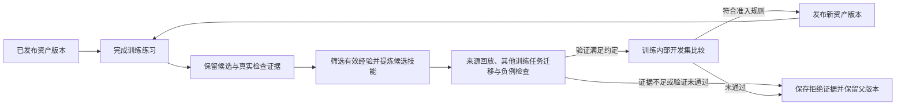

# 从训练历史积累可验证资产的 PLC 生成方法

当前已实现机制统一见 [两组件方法与证据边界](CURRENT_METHOD.md)，包括代码与需求来源关联、冻结资产检索、本题反馈、三组消融，以及尚未证明的 RSI 主张。下文保存历次设计和运行记录；其中“最新”“当前”和旧启动命令均按各自历史时点理解，不能覆盖现行三组协议或作为重启依据。

当前消融已按用户要求改为三组：Full（历史资产＋本题反馈）、NoAssets（仅反馈）、NoFeedback（仅资产），原 45 题共 135 个任务运行，每题每组最多五次生成调用。1000 条历史直接建库的规则不变；保留三组已经生成的完整结果、预算与 token，取消 Neither 的记录和费用单列。详见 [三组接续协议](../experiments/historical_assets_study/README.md)。下方四组和 180 项表述保留为历史。

## 当前执行修正：1000 题直接建库（2026-09-12）

用户明确取消 800/200 划分和训练内对照验证。旧先导服务已停止，调用与不完整记录保留，但不进入新资产学习。新入口 `experiments/historical_assets_study/direct_all.py` 使用全部 1000 条原始历史训练数据建立程序案例、修复记录与参数化片段资产库，建库不调用模型、不增加 PLC 回放或训练练习；冻结后直接进行原 45 题的资产×反馈四组消融，每题每组最多五次生成调用。测试侧编译、扫描测试和配置形式检查保留，测试反馈不回灌资产库。具体协议与华硕目录见 [当前实验说明](../experiments/historical_assets_study/README.md)。下方 800/200 和八题练习描述均为已取消的历史方案。

## 最新实施状态：历史资产学习与消融重启（2026-09-12）

用户已授权按新设计学习历史训练过程并重新进行 45 题消融。实现与协议见 [历史资产学习实验](../experiments/historical_assets_study/README.md)。本轮交付有界的类型化程序片段提炼、训练组隔离、条件化模板检索、训练侧一次更新及共同反馈下的四组消融；完整局部干预、自动行为前提判定和图组合规划尚未全部实现，不能声称完整方法已验证。

固定划分为 800 题初始建库、200 题训练内留出，先在其中八个独立组任务上做有/无资产的训练练习，每题每组最多三次调用。随后冻结实验候选 K1，对原 45 题进行 Full、NoAssets、NoFeedback、Neither 四组比较，每题每组最多五个候选、五次生成调用。模型为此前授权的官方 DeepSeek Flash及原余额不足回退路由；测试反馈不进入资产库。训练更新和测试结果分别报告，单轮消融不证明递归优于静态学习。

华硕后台服务为 `plc-history-assets-v1-20260912.service`。学习控制目录为 `/home/qyb/RESEARCH/RSI_PLC_Generation/control_history_assets_v1_20260912`，预定测试目录为 `/home/qyb/RESEARCH/RSI_PLC_Generation/ablation45_20260912_learned_mechanisms_v1`。实际阶段以控制目录的 `state.json`、`learning_progress.json` 和测试目录的 `report.json` 为准；只有全部 180 项完成并通过原始证据审计才记整个实验完成。

本机和华硕 68 项相关检查通过，隔离目录内开始执行训练。旧消融及其 STOP、费用和失败记录保持原位；下面的“停止后设计”段落保留为此前阶段记录，现已获得新一轮实验授权。

## 最新设计入口（2026-09-12，消融停止后）

用户已停止本轮生成与消融，随后要求重新设计历史知识沉淀作为论文的 RSI 核心贡献。新的方法设计见 [面向 PLC 扫描语义的可执行知识库学习](HISTORICAL_KNOWLEDGE_DESIGN.md)。本轮只交付设计，没有恢复实验、改变评价器或发布资产。

新设计具体规定程序抽象的类型/状态合同、前后转换的局部干预、跨训练组迁移、首次生成前的条件化使用，以及等数据静态学习与递归更新的对照。它仍是待实现和验证的研究假设。下文所有“正在运行”和累计通过数字均保留为历史观察，不能代替当前停止状态或新方法的效果。

这项方法的目标是让 harness 从训练任务中积累可复用的软件知识，包括程序模式、修复规则、行为约束、依赖关系和操作技能，后续生成时按需调用这些资产。模型权重不变。研究假设是：经过证据筛选和适用条件约束的资产，可以减少重复错误和无效上下文，从而改善生成成功率与 token 消耗；该假设必须通过比较和消融检验，不能由资产条数或代码实现推断成立。

## 历史状态（2026-09-12 17:13，UTC+08:00；实验现已停止）

两组件消融已改为统一基础提示的 `common_prompt_v2`。此前v1在实际请求核对中发现：本题尚无反馈时，有反馈与无反馈组的通用提示已经不同，因此无法把差异只归于反馈。该批次协作停止派发并完成在途判卷，保留12个任务运行、22次调用、264549 token；epoch `1789204345.8682232` 的原始用量与代码/判卷审计通过。先导记录不用于组件效果估计，也不删除或转移其成本。协议修订依据输入可比性，不是根据哪组成绩更高选择保留结果。

v2四组使用完全相同的通用system，在产生实际反馈前，Full与NoFeedback、NoAssets与Neither的首请求分别逐字一致；有反馈组只在出现真实结果后追加本题诊断、检查历史及修复指令。51项协议检查、45题校准绑定和180个零模型请求边界通过，预检逐题比较同资产条件下的首请求哈希。epoch `1789204346.396989` 的监督状态为generating，华硕服务 `plc-ablation45-assets-feedback-v2-20260912.service` 实际PID2638635在线。完整180项最终结果尚未产生。

epoch `1789204555.777463` 的实际请求进一步确认：首题四组均返回 `deepseek-flash`，同资产条件的model请求和实际wire消息逐字一致。已有2/180独立判卷完成，尚不能计算终局组件收益。原始输入绑定、预检、先导成本及现场快照见 [v2启动与请求证据](../experiments/ablation45_study/results_20260912/common_prompt_v2_1789204555.json.gz)。

新根目录为 `/home/qyb/RESEARCH/RSI_PLC_Generation/ablation45_20260912_assets_feedback_v2`，仍为原45题、四组、每题每组最多5候选/5调用；模型、资产、校准评价器、资源和停止规则不变。v2从空代码开始，不使用v1或原续跑候选与诊断作为输入。测试反馈不学习，新抽象资产发布仍为0。累计续跑42/45与本次平衡预算消融分别报告。完整协议见 [消融说明](../experiments/ablation45_study/README.md)。下述v1“正式开始”等表述仅保留当时观察，现由本段更正。

### 此前状态（2026-09-12 16:56，UTC+08:00）

按用户要求，当前优先进行历史资产与本题反馈的两因素消融。`Full`、`NoAssets`、`NoFeedback`、`Neither` 四组分别保留两个组件、去掉资产、去掉反馈及同时去掉两者。所有组对原首次未通过的全部45题重新生成，每题每组最多5次调用，合计180个任务运行、最多900次调用；不继承先前续跑的代码或诊断。已有训练资产冻结，测试反馈不进入学习。这里消融的是历史资产的使用，不能据此证明重新学习或迭代发布资产的效果。

华硕目录 `ablation45_20260912_assets_feedback_v1` 的49项协议检查、45题校准绑定、180个首请求边界检查均通过。原v12正常结束并审计后，消融监督进程于epoch `1789203169.6567128` 进入生成阶段；服务 `plc-ablation45-assets-feedback-v1-20260912.service` 实际PID2627603在线。首批四组真实请求均从空代码开始，官方接口均返回 `deepseek-flash`。关闭反馈的真实请求只有需求、固定接口、本次自生成的上一份代码及哈希、允许的历史资产，没有诊断与检查历史。当前尚无完整消融结论。协议及复核入口见 [两组件消融说明](../experiments/ablation45_study/README.md)。

首请求预检仅在3/45题检索到历史代码资产；其他题的历史修复检索可能要依赖后续实际错误。关闭反馈的组也关闭诊断驱动的检索，避免间接泄露本题结果。因此需要同时报告实际资产使用率和两组件交互，不能把开启开关等同于已经使用资产，也不能由整体差异直接推断知识提炼质量。

v12终局审计于epoch `1789203169.459708` 通过：4题中新增1个通过、3个未知，45题累计42个通过。该轮17次调用、388951 token；包含此前历史累计625次调用、5664076 token。此累计探索结果与本次从头开始、预算相同的消融分别报告。新抽象资产正式发布数仍为0。原格式回退v13仅在本地准备，本次没有启动；消融四组均关闭该选项。以下保留此前时点观察。

### 此前状态（2026-09-12 16:16，UTC+08:00）

最新现场报告 `1789200955.867146` 新增滑动平均 `220_FloatingAverage` 独立三阶段通过，45题累计42通过，余3题在原v12进程继续。该题本轮2次调用、30057 token；最终程序移除递增累计和状态，每次采样对有效缓冲区重新求和。实际代码结构发生变化，独立检查均绑定最终源码。浮点运算顺序也发生变化，因此不宣称与旧实现逐位等价；每扫描的计算成本尚未比较，结论限于冻结合同及检查范围。快照见 [新增通过证据](../experiments/hard45_study/results_20260912/v11_final_v12_live_1789200551/floating_average_pass.json.gz)。这是原v12的结果，与下述未部署的格式回退修订无关。

当前任务内检查另发现 `v2-M-58` 的两个精确补丁因原文不能唯一匹配被拒绝，耗费44244 token且没有改码。新增默认关闭的 `complete_code_after_invalid_edits`：拒绝补丁后，余下预算内要求返回绑定当前源码哈希的完整代码，仍拒绝错误哈希与额外补丁，不做模糊匹配、不增加调用、不发布资产。40项相关协议检查通过；该修订仅在本地准备，未修改正在运行的v12，也尚无真实成本收益结论。

华硕最新快照 `1789200551.875707` 确认：v11 已正常终止，`1789200283.5142555` 的完整审计通过；6 题新增 2 pass、4 unknown，45 题累计 41 pass。本轮 15 次调用、387694 token，历史累计 608 次调用、5275125 token。测试资产未变，反馈未进入学习；该累计探索结果不能替代原始相同五次预算比较，也不能作为新 RSI 资产的效果证明。

v12 已在审计后启动，服务 `plc-hard45-timeout-evidence-v12-20260912.service`、PID 2606481 的命令行与研究根目录核对一致。86 项适用协议检查、45 题校准绑定及4题请求边界通过，旧50题专用检查因缺少历史目录明确跳过。四题各最多5次新调用；独立评价器、验证资源、原资产、低强度思考及65536输出上限保持原值。快照中实际响应均返回 `deepseek-flash`，尚无新的独立通过。一次性续跑控制器已完成准备、预检和启动，但即时进程身份确认报错退出；后续实际进程和请求确认新任务正在运行，不能重启控制器或生成任务。原异常记录保留，不能将控制器标为全流程成功。

训练侧60个案例的规则回放已完整执行，记录1个来源案例和5个迁移案例整程序修复，零模型调用。原终局审计因缺少运行轨迹异常退出；独立修订只增加明确拒绝检查，7项单元检查通过，复核仍拒绝该批次，没有放宽门槛。只读原始证据诊断在51个案例建立目标正负例对照，6个修复均在其中；另8个案例的修改及负例编译失败，没有运行轨迹，1个参考程序形式结论未知。完整批次未通过，开发准入尚未执行，正式发布的新抽象资产仍为0。诊断不替代终局审计，也没有额外PLC执行或测试反馈学习。

此前快照、v11完整审计、v12实际请求摘要及训练拒绝诊断见 [续跑证据](../experiments/hard45_study/results_20260912/v11_final_v12_live_1789200551/snapshot.json.gz)。本机磁盘已满，该JSON作无损gzip压缩并核对解压字节一致，远程原始文件仍保留。下文保留此前观察和方法设计，旧“仍在运行”“尚未启动”等表述只描述当时状态。

### 此前观察（保留历史）

方法的研究框架已确定为：从训练证据提出知识需求和候选，按内容选择规则、模板、状态机、依赖图或操作技能，核对适用条件，经来源回放、跨训练任务迁移及开发集准入后发布，再由已发布版本参与下一轮训练。知识图谱服务于关系查询与依赖诊断；完整图谱生成链路尚未实现，新抽象资产通过准入的发布数仍为零，因此尚未证明稳定的递归收益或 token 节省。

最新已核对快照 `1789198164.4858289` 为累计41/45，v11及训练回放仍在运行。电梯任务`v2-M-29`新增独立编译、运行、配置形式检查通过，本轮4次调用、97519 token，最终源码哈希为 `6b4b0cabe7888c6060ed7388321e0c7c1bba7f7f3d85500f81eea67523836eaa`；第3、4次真实请求使用了超时重构指令。v11已完成4/6个独立判卷（2通过、2未知），已有完整生成计入7次调用、138222 token，历史累计600次调用、5025653 token；在途用量尚未全部结算。训练回放完成58/60个案例，6个记录整程序修复，零资产发布，终局审计尚待完成。状态、源码绑定和原始请求核对见 [阶段证据](../experiments/hard45_study/results_20260912/v11_progress_v12_ready_1789198164/status_and_elevator_pass.json)。

v10 已完整结束，并在 `1789196601.7883039` 通过终局审计：10 题新增4 pass、6 unknown，45题累计通过39题。新增 `245_DatabaseManager`（1次调用、12734 token）、`TE_C07_C03_01`（3次、58366 token）、`v1-M-3`（1次、9820 token）和 `v2-M-42`（1次、7930 token），均有独立编译、运行、配置形式检查通过证据。本轮总计13次调用、266395 token，全部返回 `deepseek-flash`，无重复程序或仅思考截断；历史累计593次调用、4887431 token，训练建设成本另计。这是追加预算后的累计探索结果，不能替换原始五次预算比较。

华硕快照 `1789196730.6167266` 确认 v11（PID 2565925）和训练规则回放（PID 2425093）都在运行。训练回放完成49/60个 outcome，其中5个记录整程序修复，零模型调用、零资产发布；完整目标断言审计与开发准入尚待完成。v10剩余6题均已通过编译和运行，但独立形式检查未建立结论。滑动平均底层两个性质的4次扫描完成性检查也均记录超时，但其顶层诊断仍为 portfolio unknown；记录这些限制不等于已证明代码错误。不将测试修复写入资产库。

随后时间戳 `1789196949.3144648` 的真实请求和独立检查记录确认：v11新增 `v1-M-1` 通过，累计40/45，余5题继续执行。该题本轮1次调用、9981 token，实际请求使用超时重构指令、`deepseek-v4-flash`、低强度思考和65536输出上限，返回 `deepseek-flash`。修改删除六个冗余临时状态，将循环内的溢出分支改为循环条件及循环后检查；ST和生成的`POUS.c`确实发生变化。独立编译、运行、形式通过回执均绑定最终源码 `5b856f0d723d0365c38a0d1bf0aac101f5f6fec5647a601025d0c97528759890`。这是使用该分支后产生新通过的单题观察，不是已证明通用等价、因果收益或稳定token节省；整轮尚未审计。

本次状态、v10终局审计、v11预检及启动记录见 [快照目录](../experiments/hard45_study/results_20260912/v10_final_v11_started_1789196730/summary.json)，随后新增通过及真实请求见 [后续记录](../experiments/hard45_study/results_20260912/v10_final_v11_started_1789196730/v11/first_live_evidence.json)。之前14:47的中途记录保留在 [旧快照](../experiments/hard45_study/results_20260912/method_status_1789195645/snapshot.json)。后文按发生顺序保留旧轮次结果及被后续证据否定的解释。

当前修订新增默认关闭的 `refactor_formal_timeouts`：只有同一候选的编译和运行均通过，且形式检查所有未确定诊断均明确记录后端超时，才允许在剩余候选预算内提出结构简化。原工具重试、unknown 回执、独立评价器、形式资源上限与历史费用均保留；重复超时代码不能进入已确认失败缓存，每份新代码重新执行全部检查。模型的行为保持说明是待检验论证，不是已建立的等价证明。46项相关协议检查通过；华硕冻结v11通过78项适用检查、45题校准绑定及6题NoModel边界核对。一个缺少旧50题目录的测试明确跳过，当前45题另行核查。v11在 `1789196692.2620552` 启动，每题最多5次调用，低强度思考、65536输出上限和原总预算不变；首请求边界中 `v1-M-1`、`v2-M-43`、`v2-H-3` 选择新分支。这些检查不证明PLC正确性，该修订属于测试任务内的harness策略，不发布RSI资产。

后续修订补充回执摘要遗漏的后端超时证据。`backend_timeout_evidence` 从同题、同源码的原始工具结果读取已执行且明确超时的后端尝试；对于输入性质组合检查，再核对生成源码、组合检查报告的清单哈希和逐次扫描完成性回执。只返回时间、执行状态、来源路径和哈希，不提供生成的验证C源码或参考答案。原unknown状态与“回执缺失、无效或迟到”等原因保持原文，存在超时记录也不意味着其他未知原因已解释清楚。54项相关协议检查通过；首次测试日志含重复收集的导入测试类，修正收集方式后以54个不重复检查为准。

华硕 `control_timeout_evidence_v12_20260912/projection_preview.json` 在 `1789197913.8434975` 对四个已有完整生成结果进行只读预演。滑动平均的两个性质各有两次清单绑定的扫描完成性超时；`v2-M-43` 的一个未知性质包含明确的NuSMV超时记录。两题在不改状态或原原因的条件下，由缺少触发证据变为允许有限结构重构；全部新增文件来源哈希核对通过。其余两个已通过的程序不触发该分支。预演没有模型调用、PLC重新检查或资产发布，不能作为新增通过证据。v12控制代码已上传，必须等待v11完整结束与审计后才能准备、预检和启动新的冻结轮次。本地副本见 [反馈预演](../experiments/hard45_study/results_20260912/v11_progress_v12_ready_1789198164/projection_preview.json)。

## 方法论与知识表示的选择

方法研究的是如何从训练过程提炼、验证和复用软件知识。本体、知识图谱、规则、代码模板、状态机和结构化技能都是可选择的工具。不能把采用某个工具本身当成方法贡献，也不能把简单存储或检索改名为知识提炼。

统一方法分成六个环节：**识别知识需求 → 从训练证据归纳 → 选择合适表示 → 验证可复用性 → 按条件调用 → 经准入迭代资产**。每个环节都有输入、输出和拒绝条件。

当前研究主线已确定，但新候选尚未通过开发准入发布，不能声称稳定的 RSI 收益。2026-09-12 的 v7 测试续跑修复的是任务内反馈恢复和生成响应截断：恢复 exact-code 历史反馈、关闭隐式长思考、可选携带有长度限制且明确未验证的同题分析稿。它继续消费冻结训练资产，不能作为新知识发布或递归资产改进的证据。

v7 的终局审计表明，50 次调用均正常返回答案，15 个待完成任务仍为 0 个新增通过、8 个失败、7 个未知；该设置解决了此轮响应截断，未建立测试通过率收益。之后独立 v8 增加同题历史代码起点选择和对明确算术异常的有限修复，保留 unknown 状态与全部历史费用，且重新验证所选代码。v8 已结束，并在时间戳 `1789192200.613387` 通过终局审计：15 题新增 1 个通过、7 个失败、7 个未知，累计 31/45；48 次新调用、372564 token，历史累计 566 次调用、4356571 token。新增通过的 `216_RandomNumber` 在本轮用了 3 次调用、17421 token，通过配置的编译、运行和形式检查。它们是 harness 执行策略修订，仍未发布新训练知识，不能描述为已完成 RSI 资产递归改进；31/45 是多轮追加预算下的探索结果，不能替代原始单轮五次尝试的比较。

当前可以确定方法的研究框架：训练证据筛选、条件化知识提炼、多种表示、训练内验证、按需复用及版本递归更新。不能确定的是这套框架已经稳定提高生成成功率和降低总 token。新抽象资产的开发准入通过数仍为零，依赖图的诊断作用尚未接入正式生成比较；后续应优先完成训练侧的迁移与准入，而不是把追加测试尝试当作知识学习效果。

随后启动的 v9 独立检验思考输出预算：对剩余 14 题各最多一次调用，低强度思考、单次最多 65536 输出 token，保留全部历史成本和冻结评价器、资产。华硕在时间戳 `1789192588.232448` 启动；70 项适用协议检查和 45 题校准绑定通过。时间戳 `1789193285.131698` 的中途状态是 8/14 完成、3 个新增通过、4 个失败、1 个未知，累计 34/45；已完成生成计入 10 次调用、166333 token，含尚待独立判卷的候选。新增 `v2-M-32`、`214_DayOfYearCalculator`、`225_MergeBytes` 各一次调用，分别 15348、11970、14054 token，独立编译、运行、形式检查均通过。该轮尚未结束或做终局审计，且只检验生成设置和追加预算，不能记为新 RSI 资产的贡献。

时间戳 `1789193678.1774943` 时 v9 已完成 13/14 个独立判卷，新增 4 个通过、6 个失败、3 个未知，累计 35/45；新增通过的 `222_MaterialMixing` 本轮一次调用、25946 token。已有完整生成累计本轮13次、247597 token，含历史总计4604168 token；最后的 `v2-H-3` 仍在执行。该记录仍非整轮终局，实时情况以华硕状态和最后审计为准。

v9 现已完整结束，时间戳 `1789194426.8972073` 的终局审计通过：14 题新增 4 pass、6 fail、4 unknown，累计35/45；14次调用、264465 token，全部返回 `deepseek-flash`，14次均有思考与完整答案，无仅思考截断，思考明细162516 token已包含在输出用量内。全部轮次累计580次调用、4621036 token。随后独立v10于 `1789194514.0479243` 在华硕启动，对剩余10题恢复每题最多5次调用，继续低强度思考和65536输出上限，使用下文无损字典反馈；72项适用检查和45题校准绑定通过。该轮仍使用原冻结训练资产与独立评价器，新资产发布数为零。

| 要沉淀的知识 | 提炼方式 | 优先考虑的表示 | 生成时的作用 |
|---|---|---|---|
| 编译、类型和局部表达式错误 | 对齐训练失败与通过程序，定位局部差异并抽象类型/变量角色 | 条件修复规则、参数化修改模板 | 根据具体诊断检索，指导或执行局部修改 |
| 边沿、计数、复位与保持语义 | 比较代码控制流、状态更新和扫描轨迹，归纳共同机制与前提 | 代码模式、状态机、行为约束 | 为新任务构造控制结构，检查优先级与扫描顺序 |
| 模块依赖、互锁和约束传播 | 从接口、调用和需求中提取关系，对照代码与验证证据 | 本体约束下的知识图谱 | 查找需要同时满足的条件，选择和组合相关模块 |
| 已验证的完整功能实现 | 保留完整行为合同与接口，识别与当前任务的差异 | 功能块/程序案例库 | 作为可改造的实现参考，减少重复生成 |
| 多步生成与修复策略 | 跨训练任务比较操作过程及结果，归纳何时采用何种步骤 | 结构化操作技能、决策规则 | 指导 harness 的工具调用和修复次序 |

这些表示不必同时全部实现。先在训练数据上确定哪些知识有足够证据、出现频繁且能被明确验证，再安排实现与消融。训练数据不支持的关系不能为图谱规模或论文表述而补造。

不同表示共享资产目录协议：适用条件、操作内容、来源证据、验证范围、版本状态、使用成本和依赖关系。统一的是资产管理与验证规则，不要求将所有知识强行转换成同一种图或同一段文字。

2026-09-12 新增 `knowledge_candidates.py` 将这一原则落实为独立的候选协议：模型先提出 `knowledge_need`，再选择 `representation` 并说明 `selection_reason`；输出必须包含前置条件、相应表示的操作载荷、验证义务、适用边界，以及指向至少两个成功训练程序的逐字引用。规则、模板、状态机、依赖图和操作步骤具有各自的结构检查。来源不足时允许 `abstain`，不强迫产出知识。程序检查引用是否实际存在、状态与图关系端点是否合法、来源及传递来源是否均属于训练源分区；不将这些检查解释为引用蕴含了规则、修复存在因果关系或规则具有迁移能力。

该协议的状态固定为 `knowledge_candidate`，明确记录语义蕴含未验证、迁移未验证、禁止直接发布。条件里的 `check` 字段指定未来检查方式，不表示该条件已经满足。当前依赖图只是有类型的关系记录，尚未接入 OWL 推理、图检索或生成规划。现有生成器继续使用已冻结资产，不会自动消费这些候选。九项协议检查覆盖训练/开发/测试及传递来源隔离、伪造引用拒绝、图与状态机端点、模型自报通过拒绝，以及证据不足时放弃提案。

这一设计包含三个相互配合的机制。第一是证据约束的归纳：从具体训练实现及其失败、修改和检查结果中提出可迁移的知识假设。第二是条件约束的复用：先核对接口、类型、状态和行为条件，再决定采用哪些资产及如何组合。第三是反馈驱动的版本更新：在训练侧检验资产应用结果，修订适用边界、拒绝无效候选，并让通过准入的版本参与后续训练。三者共同构成方法，具体存储技术服务于这些机制。

资产有三个不同证据层级，不能混称为“已学会”：某个训练实现通过检查，是实例证据；多个实例支持一个共同机制，是候选知识；经过独立训练任务迁移与版本比较后允许使用，才是已发布资产。修复前后有许多同时变化时，仅观察最终通过不能定位哪个修改起作用；需要在训练侧回放候选修改、检查其他行为，不能直接宣称找到最小补丁或证明因果。

知识提炼也不等于统一调用模型写总结：能从接口、类型、代码差异与工具回执确定的事实先由程序提取；需要跨实例抽象的部分由模型提出候选；候选再通过训练例子复现、其他训练任务迁移及开发集比较。对于图关系，还需检查关系类型、端点及证据是否符合本体；对于代码模板，则需要类型匹配、实例化和程序检查。SHACL 通过不能代替 PLC 行为验证。

递归更新发生在训练侧：已发布资产参与新的训练练习，新增过程用于提出资产修订，验证通过后发布下一版本。45 题只消费冻结版本与当前题反馈，不能成为资产来源。改进有效性最终应分别归因到表示方式、提炼机制、适用条件、检索/组合方式和晋级机制，而不是统称为“加了知识图谱”。

`ontology/` 当前是关系类资产的一项候选基础设施，已有 RDF/OWL 与 SHACL 草案；它不代表图谱已接入生成链路，也不代表全部知识都将采用图谱。`guarded_retrieval.py` 和 `guarded_workflow.py` 则是修复资产使用链路的修正，已通过相关协议检查并于 2026-09-12 在华硕独立续测目录启动。实验记录实际使用的资产和机制；这些实现不能统称为已完成 RSI。

## 一、资产不是聊天历史，也不只是正确答案

| 层次 | 保存什么 | 用途 | 可以声称什么 |
|---|---|---|---|
| 原始证据 | 训练需求、接口、所有候选、检查回执、修改顺序、token、版本与哈希 | 追溯经验来源，保留失败和未知 | 某代码在某组检查下取得某结果 |
| 程序案例 | 完整通过检查的训练 ST、适用接口及行为合同 | 提供可改造的实现参考 | 该训练案例在限定验证范围内通过 |
| 修复经验 | 具体错误、失败代码、有效修改差异、修改后回归结果 | 遇到同类错误时指导局部修改 | 某次修改后建立了通过结论；不自动证明因果或泛化 |
| 条件化技能 | 触发条件、前置约束、操作步骤、检查方式、不适用边界 | 用短规则复用跨任务共同机制 | 来自训练证据的可检验操作假设，晋级前不能视为有效增强 |

例如，一条技能可以描述“带复位的边沿计数器如何组织复位优先级、边沿状态更新和计数饱和”。它必须说明何种接口和扫描语义下适用，以及如何检查复位、持续高电平和边界值。这里仅说明技能的形式，不是在把测试题修复方案写进知识库。

技能正文采用现有五个字段 `trigger`、`preconditions`、`procedure`、`verification`、`boundary`。独立来源记录保存训练任务 ID、原始代码与反馈哈希、提炼调用、适用工具范围、父资产版本和晋级证据。短正文与完整证据分开存储，不能通过压缩正文丢失来源。

### 知识目前怎样提炼，核心设计还要补什么

现有技能实现采用 JSON 中的结构化自然语言，不是 OWL/RDF 本体，不是知识图谱推理，也不是自动合成并执行的程序变换规则。`experiments/rsi_study/learning.py` 按目标平台与训练类别选取至少两个成功训练程序，调用 DeepSeek；`skills.py` 的提示要求提炼两个程序共同可见的机制，输出上述五个字符串字段。结构、长度与来源校验通过后成为候选技能；资产版本仍须通过开发集准入。测试时由文本检索选出技能，放入模型提示，模型自行理解和实现其中的步骤。

2026-09-12 的本地修订新增可选设置 `curator_include_verified_repairs`，默认关闭以保留旧训练协议。开启后，`curation_evidence.py` 为每个用于抽象的成功训练程序最多选择一条修改后代码完全一致、代码哈希正确且具备编译/运行/形式通过记录的修复观察。模型同时收到局部差异、失败诊断与证据边界，来源绑定覆盖新增修复记录及其传递学习来源。开发集和测试来源被拒绝。该修订已通过 14 项提炼证据与 RSI 协议检查，尚未部署到新训练轮次；它仍输出候选文字技能，机器可检查的通用规则和迁移验证尚待实现。

因此，当前技能的“适用条件”主要由模型阅读理解，规则提炼的正确性也没有被单独证明。JSON 是存储形式，不是本体；五个字段齐全仅证明响应结构符合要求。之前 117 题使用的冻结 v1 甚至没有接入这些技能。

后续核心设计采用轻量的 PLC 语义描述与可验证技能，而不是仅扩大文字记忆库。一个技能需同时具备三个部分：

1. **匹配条件**：目标语言/方言、变量类型与角色、数据范围、状态是否跨扫描保持、触发方式、复位优先级、时间单位等。可确定的条件由程序检查；不能确定的条件不得假装满足。
2. **实现或修复操作**：参数化的局部 ST 模板、带 AST/类型约束的修改，或有序操作步骤。训练任务中的具体名称映射为 `counter`、`limit`、`reset` 等语义角色；不能简单替换变量名而忽略类型和扫描语义。
3. **验证义务与来源**：实例化后需检查的性质、正反例、训练来源、原失败与修改后通过的绑定证据，以及适用边界。规则本身是候选假设，执行检查后才能谈有效性。

例如，“固定上限的饱和计数”技能可以要求：计数器为跨扫描状态，上限为非负且运行中固定，复位具有最高优先级；操作是先处理复位，再在有效事件且计数低于上限时递增；验证义务包括复位清零、无事件不增加、计数不越界。若当前任务允许上限在线降低，这条技能的前提不成立，必须拒绝应用或使用另一个有相应证据的技能。这是结构示意，不代表本次已从训练中提炼并验证了一条新资产。

具体提炼过程应为：从训练失败和通过回执定位有效修改 → 对齐修改前后程序的类型、变量角色和控制结构 → 让模型提出共享规则及前提 → 将候选规则实例化回训练例子并重新检查 → 用其他训练任务检查迁移及反例 → 满足准入后写入版本库。模型负责提出和解释候选规则，工具负责检查代码和规则应用后的结果。

应用时分两路：能够安全实例化的局部模板或变换，由 harness 应用并重新验证；需要组合推理的技能，把条件检查结果、变量角色绑定、短操作步骤和验证义务交给 DeepSeek生成完整程序。两路均不能绕过当前任务的完整检查。新增规则只有在训练证据上建立，不从 45 道测试任务提取具体补丁或答案。

领域词汇和类型约束可以通过本体组织；需要依赖查询与关系组合的知识可以进一步构建图谱。具体采用多强的语义表示，应由训练数据中的知识需求和验证结果决定。研究重点是这些表示是否能准确约束资产适用性，以及经过验证的知识能否跨训练任务迁移。上述机器可检查条件、程序变换和逐技能迁移验证属于需要补齐的设计，不能声称当前代码已全部实现。

## 二、沉淀流程：先筛证据，再抽象知识

1. 从 1000 个训练任务的原始历史中读取需求、接口、成功程序与失败过程，核对合同和代码哈希。合同不同的旧轨迹不能直接归到当前案例。
2. 将修改前后的代码和反馈配对。最终轨迹成功，不等于其中每一次修改都有效；仍然失败的转换保留在原始证据中，不能与直接通过回归的修复混作同一种可用经验。
3. 对可用修复提取候选局部变更及其错误条件，在训练侧回放检查其作用。首要表达是“在什么条件下，哪个表达式或状态转换需要怎样改变”，而不是两份完整程序；未经消减与回放，不能称为最小有效变更。
4. 汇集至少两个训练任务中共同出现、得到验证的机制，用 DeepSeek 提炼条件化技能。模型负责提出规则，不能给自己的规则宣布通过。
5. 核查规则是否忠实于来源：有无凭空加入前提、忽略计时或类型边界、把相关性写成因果结论。来源不足、解释不完整的提案保留并拒绝晋级。
6. 将候选资产放入训练内部开发任务，比较使用父版本和候选版本的成功任务、重复失败、未知结果与完整 token 开销。只有符合预先固定准入规则的版本才能发布。

已经执行过的训练轮次主要支持“从成功训练程序提炼共同技能”。旧五字段技能路径新增的可选输入支持将严格绑定的修复观察交给提炼器；该路径的修订尚未执行新的真实提炼、局部修改回放及迁移验证。下述多表示候选试点独立记录，不替换旧轮次，也不能把输入链路和检索修正称为已经完成知识验证。

新的独立试点 `experiments/rsi_study/knowledge_pilot.py` 从既有 970 个训练源程序中筛出有严格绑定修复观察的 139 个任务，按预先固定的目标平台/类别哈希顺序选三组、每组两个不同来源组的案例。使用 DeepSeek Flash，每组最多三次提案调用，合计最多九次。该试点只检验带证据的表示选择与候选提炼，不运行测试题，不自动发布资产，也不能称为新的训练练习或已完成递归改进。提案内容、来源、请求、拒绝、token 与冻结输入均保存，后续仍须实施实例回放、其他训练任务迁移及开发准入。

该试点已在华硕完成：四次模型调用、72096 token，产出三个通过结构与逐字来源检查的条件规则候选。API 用量、模型原始输出、来源和冻结输入审计通过，四次实际返回模型均为 `deepseek-flash`。随后进行的代理定性来源复核发现两项过度归纳：一项删除了第二个案例的子系统启用条件；另一项把阈值复位条件替换成另一个案例的启动/过载复位条件。这两项按当前表述拒绝准入，第三项需要补足条件证据、进行训练回放与迁移验证。该复核不是独立盲审或 PLC 工具验证；新发布资产仍为零。这些结果说明本试点必须区分结构可追溯与语义忠实，不能作为方法改善生成成功率的证据。

试点证据位于华硕 `training_refinement_20260912/knowledge_pilot_v1/`；本地摘要、提案和来源复核快照见 `experiments/hard45_study/results_20260912/methodology_revision_1789182013/training_knowledge_pilot_v1/`。`knowledge_pilot_audit.py` 复核原始训练记录、实际模型输入、候选内容和全部 API token；它不会发布候选，也不会改动运行中的测试资产。

### 从文字候选到条件绑定和可执行操作

`boolean_contract_rule.py` 实现了一个范围明确的训练原型：从两个不同来源组的训练合同中匹配无条件的布尔等式 `output = request AND NOT ready`，把具体变量映射到输出、请求和就绪三个角色。应用时重新核对目标平台、三个标量 BOOL 的类型与输入/输出方向、扫描开始采样和扫描结束观察，并要求输出在功能块内部没有被读取。带启用条件的蕴含式、不同复位谓词、别名、提前返回或不支持的词法结构会被拒绝。该解析器只支持声明的合同片段，不是完整 IEC 或时序逻辑解析器，也不能把缺少条件解释为条件成立。

操作在功能块扫描结束前追加绑定后的等式，保留原控制结构，避免删除原赋值后产生空分支；完整程序仍需重新编译、运行和形式检查。规则包含源程序、合同条款、变量绑定和内容哈希，保持候选状态。它没有接入测试生成器，也未通过开发集晋级。七项检查覆盖变量改名、条件和类型不符拒绝、输出内部读取、提前返回、来源组与传递污染隔离。

这条原型的操作模板由工程代码实现，程序从训练合同中抽取角色并核对来源，不能描述为模型已经自动合成了任意程序变换。其适用要求中直接给出了布尔等式，因此“直接根据当前公开合同执行同一修改、完全不读取历史资产”也是需要比较的简单解释。只有与这一对照比较，才能区分合同实现、人工编写的变换器和历史知识积累各自的作用；少量回放成功本身不能证明 RSI 的必要性。

新增输入角色检查拒绝扫描采样输入被直接赋值或绑定为调用输出参数。该检查只覆盖显式语法，不能代替完整别名和调用副作用分析。对扩大回放的 60 题、120 份参考及历史程序核查后，没有改变可应用范围。另一个专门构造的程序能通过编译，但因为改写输入而违反扫描采样约定；原生运行正反例确认该差异。此反例仅用于检查规则前提，不加入训练或测试数据，不发布资产。证据在华硕 `training_refinement_20260912/input_role_guard_audit_v1/`，运行中的冻结回放源代码未被修改。

`boolean_dependency.py` 进一步实现了范围受限的依赖诊断：将三个 BOOL 角色与一个布尔等式组织成带类型的节点和关系，结合实际扫描输入、观察值和断言，区分表达式计算错误与上游状态错误。对 16 个已完成且通过证据核对的训练任务、32 个修改前后程序分析时，`TR_C10_C09_05` 有六个失败扫描显示：`CrossBlocked` 符合当前 `SubsystemBEnable AND NOT CrossReady`，但 `CrossReady` 已经不符合要求；继续重写下游等式不能修复这几个观察。这是有数据支持的依赖定位，不是上游根因的因果证明，也不是通用知识图谱推理。缺少输入或观察时保持证据不足，不默认为 FALSE。原始证据在 `training_refinement_20260912/dependency_analysis_v1/`；诊断没有新增模型调用、没有进入测试资产，也没有证明加入图表示能提高生成成功率。后续需比较相同事实的平铺记录与关系诊断，再经训练内准入接入生成。

`dependency_repair_pilot.py` 已启动训练侧的两组单次修复试点。固定上述唯一依赖异常案例；两组获得相同需求、接口、历史失败代码、实际扫描计划和观察值，一组只使用这些反馈，另一组额外获得从相同观察推导的依赖图及诊断。两组均用官方 DeepSeek Flash、关闭思考、8192 输出上限，各最多一次调用，生成前冻结输入并排除成功参考代码。原训练编译、运行、形式检查继续使用，完整成本与所有失败保留，不自动发布资产。它是有选择的单案例诊断可行性试点；额外诊断增加了上下文，因此不是同内容的图表示消融，也不能单独建立因果效果。华硕目录为 `training_refinement_20260912/dependency_repair_pilot_v1/`，时间戳 `1789192868.064916` 启动。第一组已用 18681 token 返回程序，编译和运行通过、形式 unknown；第二组仍在检查，尚无整轮结论。独立审计器会重新核对 API、完整输入、原始运行断言及形式输出，未通过审计前不记为有效新知识。

该试点随后正常结束，时间戳 `1789193715.3867195` 的独立审计通过。原始反馈组为编译/运行 pass、形式 unknown，18681 token；依赖诊断组为配置三阶段 pass，19509 token，两组总计2次调用、38190 token。审计从服务端原始响应重算用量，从冻结用例和原始运行输出重建断言，并核对形式适配器原始结果。通过组的形式范围是14条需求中的11条可原生表达性质，另3条不在该形式配置覆盖内；8个性质案例具有无界证明记录、5个具有有界未发现反例记录，不能统称为14条完整证明。两组运行都通过，差异发生在形式检查能否建立结果，不能表述成诊断组修复了原始组运行测试仍存在的错误。依赖诊断组多用828 token；还没有证据证明减少总成本。该结果支持后续训练迁移检验，不能凭一个选择过的案例发布通用技能或宣称稳定效果，新发布资产仍为零。

后续程序与后端核查进一步否定了把该差异当作知识收益的解释。两组ST去除本例的注释和空白后完全一致，生成的 `POUS.c`、`POUS.h`、`LOCATED_VARIABLES.h` 和 `driver.c` 均逐字相同；P7的形式模型SMV也逐字一致，求解脚本仅轨迹输出路径不同。原始组P7求解在90058 ms超时，诊断组在88122 ms返回通过，两者的上限同为90秒。这表明没有观察到两组可执行程序的改进，形式结果在时间阈值附近的差异不能归因为依赖知识；具体运行时差异的来源尚未确定。原始unknown和全部费用保持不变，不把另一组的证明追溯改记为原始组当时通过。证据位于华硕 `training_refinement_20260912/dependency_program_equivalence_v1/report.json` 与 `formal_timing_comparison.json`。后续比较必须同时检查实际代码是否变化、语义相同候选的工具结果及完整成本，不把单次形式pass/unknown差异当作方法效果。

新增训练来源适用范围核查 `training_refinement_20260912/boolean_rule_coverage_v1/report.json`，仅读取排除开发与测试来源后的 970 个训练程序。其中 912 个合同包含该原型可识别的唯一布尔等式，452 个同时匹配当前规则目标平台；451 个成功程序和 62 个严格绑定的历史失败程序允许生成规则修改候选。完整检查仍然必须重新执行，62 不是修复成功数。另有一个成功程序因提前返回等结构被拒绝，一个历史程序因功能块结束不明确被拒绝；目标平台不符、缺失修复证据或条件不符均保留拒绝原因。这次核查无模型调用、无资产发布，也不使用开发或测试反馈。较高的合同重复模式覆盖提示，需要区分共同布尔子需求与完整任务重复，并保留直接合同实现对照，不能把覆盖率当作知识泛化证据。

据此启动独立扩大回放 `boolean_rule_replay_all_v2`，纳入两个原始来源和 58 个其他来源组的可应用训练案例。选择规则、哈希顺序、来源组隔离和输入先于回放结果固定；不再只选诊断提及目标输出的失败案例。每题仍保存参考、历史失败、规则修改和错误极性负例，使用原训练用例与评价器；组间结果和无效修改都要保留。该实验不调用模型，也不直接发布资产。时间戳 1789189952 附近仍在运行，首批六个结果中一个修复；未完成终局审计，不能用中途比例代表全组迁移效果。

时间戳 `1789192200.6803536` 的现场进度为 21/60 个完整 outcome，3 个整程序修复；这是中途统计，不能与原先六题的选择性回放合并或外推。逐题的宽泛校准标志还须接受终局目标断言审计，不能直接视为所有负例证据充分。已完成结果分析发现，一个案例没有足以建立目标断言正反例的运行轨迹，必须保留为未建立证据，不能为发布候选而放松原门槛。

扩大回放的审计重建全部预选训练组，拒绝删除无效案例或事后重排，并保持原来的目标断言正反例验证要求。该准入前实验还不是递归闭环：后续仍须将可复用知识与直接合同实现对照，在训练内部开发集比较，只有获得准入证据才能发布并参与下一轮训练。

`experiments/rsi_study/boolean_rule_audit.py` 新增独立的只读证据核对：从冻结源记录重新构造规则和四个程序变体，从原始运行输出重新计算断言结果，并核对形式验证适配器的原始输出。负例必须在同一条目标输出断言上由通过变为失败，同时其他被观察输出不变；仅有一个笼统的失败状态不够。五项审计检查覆盖无关失败、断言被改、其他输出受影响、原始输出重建和缺失观察拒绝。该审计不新增模型调用，不修改评价器，也不批准资产发布。

华硕 `training_refinement_20260912/boolean_rule_replay_v1` 已完成两个来源案例及四个其他来源组训练案例的工具实验，并通过终局证据审计。每个任务保存成功参考程序、历史失败程序、规则修改结果及故意改错运算符的负例；评价器和原始训练用例固定。本轮规则应用和回放没有模型调用；前序候选提炼的四次调用、72096 token 另行保留，不能将资产建设总成本写为零。

最终修复了来源案例 1/2 和迁移案例 3/4：`TR_C01_C01_04`、`TR_C06_C03_01`、`TR_C05_C03_04`、`TR_C06_C05_02` 的历史失败程序经规则修改后通过配置的编译、运行与形式检查。`TR_C01_C01_09` 和 `TR_C10_C09_05` 仍失败，全部结果保留。六题均有参考通过和针对规则输出的负例检测证据。这里的形式通过仅覆盖记录列出的原生性质，未覆盖性质不能视为已经证明。样本预先限定为可应用该规则且具有历史失败的训练任务，3/4 不能外推为全部训练或测试任务的成功率。

该结果是一个条件规则的有限训练迁移证据；训练内部开发集准入尚未执行，新晋级资产为零，规则未用于 v4 测试，也没有成为下一轮训练的已发布版本。局部规则是否满足其目标性质，与整份程序是否还存在其他错误，应分别记录。终局报告、原始证据哈希、审计和进程快照见 `experiments/hard45_study/results_20260912/rule_replay_audited_1789184912/`。

## 三、积累流程：资产有版本、失败能拒绝

每轮从已发布版本出发完成新的训练练习，保留所有结果；从通过验证的练习中提案新程序、修复经验和技能，再进行开发集准入。新版本通过后，下一轮训练实际使用它，才构成递归改进。

现有版本机制已经具备来源绑定、不可变目录、父版本、晋级、拒绝和回滚记录。现有开发准入规则要求：不丢失父版本原来通过的题、不增加未知结果，并达到“成功增加且总 token 不增加”，或“成功相同且 token 至少减少 8%”。该规则是工程准入条件，不是统计显著性结论。若要调整成功率与费用之间的优先级，必须另立协议，不能看到 45 题结果后篡改旧准入记录。

添加更多记录不等于积累了更多有效知识。候选长期无法晋级时，要检查提炼质量、适用条件、检索和准入目标，而不能绕过准入把它们改名为正式技能。

## 四、生成流程：按需使用资产，而不是全量塞入提示

生成某一任务时，先解析当前公开需求、接口、类型、状态和计时约束，再选择适用的技能和程序参考。程序案例必须显示与当前任务的差异；没有匹配依据时可以不提供完整案例。

资产使用遵循一条明确链路：需求形成当前任务的行为合同与未决条件；资产选择器按知识需求分别查询规则、模式或关系；条件检查器确认目标平台、类型和扫描语义能否匹配；组合器将变量角色绑定、依赖条件和所需检查整理为短生成计划；模型或程序变换器据此生成候选；统一评价器检查完整候选。未知条件保持未知，不能为了命中资产而默认为成立。知识图谱用于查询和补足关系时，其输出仍要经过条件检查器。

第一次生成主要使用需求、固定接口和适用的实现技能。若检查明确失败，修复查询再加入错误类别、源码位置及当前任务的诊断，优先取短的有效修复差异。修复记忆有独立预算，分别记录检索到了多少、过滤了多少、模型实际收到多少；不能只凭开关开启就声称使用了经验库。

每次改码重新执行检查。若返回代码与已失败的程序相同，识别为重复候选并改变修复指令；不能把重复调用当成新的有效探索。编译、运行和形式检查未知时，区分工具能力、资源和接口问题，不能直接伪造程序错误或通过结论。

本地 v3 进一步实现两种使用机制。其一，模型可返回与当前程序哈希绑定的局部替换，harness 检查目标唯一性与修改范围后应用，再重新验证；这保证操作位置可追溯，不保证其语义正确。其二，反馈投影可无损压缩可容纳的失败输入前缀，并提取形式验证前端的具体解析诊断。前端拒绝仍记为 unknown，但可指导当前题的等价改写；纯超时不能被解释成已证实的程序错误。这些机制属于生成与验证链路，测试侧的错误和修改不会因此成为全局规则或技能。

v4 增加当前题的尝试记录。`repair_history.py` 将历史记录绑定到任务 ID、完整公开合同和程序哈希；不同任务或不同合同会被拒绝。提示只展示有字符上限的真实诊断与本轮修改说明，标明省略数量；生成器可识别前序轮次已经失败的同一程序，避免重复验证。纯超时仍不能被缓存为已证实的程序错误。v4 保留原先 27 个成功结果，为剩余 18 题各提供最多五次新调用，使用原冻结训练资产；本节训练规则不参与 v4。

v4 已全部结束并通过终局审计：18 题中新增 3 个通过、10 个失败、5 个未知，45 题累计通过 30 个；新增 64 次调用、486690 token，历史累计 446 次调用、3302498 token。64 次均返回 `deepseek-flash`，其中 54 个提示含训练修复记录，7 次输出重复已拒绝代码。输入、训练资产和原始 API 用量核对通过。这是额外轮次预算下的探索性累计结果，不是同一次 pass@5，也不能归因为上述训练规则的收益。

新增的 `step_dictionary_v1` 反馈表示处理重复输入对象导致的长历史截断：保存完整步骤对象的字典及其执行索引，与原差分格式比较后选择较小的无损表示。解码必须保持字段缺失、BOOL/INT/REAL 区别、调用顺序与周期数；不能将步骤对象差分误认为 PLC 内部状态。反馈仍只包括被授权的失败断言与其输入前缀，不带成功断言或参考代码。30 项相关检查通过；华硕对五个当前题失败记录作只读回放，`v2-M-29` 的原末尾六步截断可以替换为完整前缀，总反馈 7807 字符，未超过原 10000 字符限制，其余四条投影不变。该结果不产生新 PLC 通过证据，也不承诺实际提示 token 更少：相比此前不完整的 2332 字符，它提供了更多必要上下文。代码仅在本地和独立预演控制目录更新，未修改运行中的 v9；后续需在新冻结轮次验证是否改善修复。

### 单独检验生成设置的影响

检查发现此前云端提供商代码显式设置了 `thinking.type=disabled`。DeepSeek 的[官方思考模式文档](https://api-docs.deepseek.com/guides/thinking_mode/)支持显式开启并设置推理强度。`provider.py` 新增可选配置，默认仍为关闭以保持旧实验行为；开启时要求主接口与余额不足回退接口采用相同设置，完整保留服务端用量和实际请求参数。思考 token 包含在输出 token 中，不能重复加计；接口未给出明细时报告缺失，不视为零。仅有思考文本、没有完整代码的截断响应仍消耗调用与 token，并作为无效响应处理。

独立 v5 轮次在华硕 `hard45_20260912_thinking_v5` 启动，对剩余 15 题各最多新增五次调用，使用同一个请求模型 `deepseek-v4-flash`、`thinking=enabled`、`reasoning_effort=high`，单次输出上限从 4096 调整为 8192 token；逐题总 token、评价器、用例、判定标准和冻结资产不变。该轮检验的是生成设置和额外尝试的作用，不是 RSI 的增益，也不是相同输出预算下的对照。思考模式是否实际返回相应内容、是否截断以及完整成本都按原始响应审计。

本地 44 项相关检查通过。华硕冻结快照通过 43 项适用检查；一个依赖旧 50 题目录的测试因该快照不含该目录而明确跳过，首次未跳过时的失败日志保留，没有修改该测试的断言或补入旧参考答案。当前 45 题校准绑定、评价器及资产相对父版本不变、15 题首次模型请求边界均另行核对通过；预检不产生模型调用。启动与 v4 终局证据见 `experiments/hard45_study/results_20260912/thinking_v5_start_1789185741/`。

真实调用随后否定了直接扩大该配置运行的做法。v5 的 17 次调用中有 16 次将 8192 个输出 token 全部用于思考，没有返回代码。因此通过 STOP 阻止后续派发，让四个已启动任务在原预算内收尾；其余 11 个任务没有启动。终局记录为新增成功零、230628 token，所有请求用量经过 `cooperative_stop_audit.json` 核对。该文件明确标记实验批次未完成，只证明已启动任务收尾及未启动任务确实零调用，不伪装为完整实验。

较低思考强度先在训练任务 `TR_C01_C01_09` 上进行一次独立检查，返回可解析的程序修改，用时 13.31 秒，12034 token，其中输出 3294、思考 2956。程序随后通过固定训练编译、94 条运行断言和配置的原生形式性质，源码、原始 API 响应、运行输出与形式回执审计通过；该结果不是测试成功，也没有自动发布为资产。首次验证启动因使用了不包含训练验证器的测试快照而在 import 阶段失败；保留记录后改用原训练验证器快照执行，没有新增模型调用。审计首次缺少修改解析模块的导入也已保留，通过显式加载被冻结的修改解析器后核对成功。

较低思考强度在复杂测试题上的单题控制仍然失败。v6 为 15 题完成准备，但仅启动 `v2-M-29`，该题五次调用均仅思考后截断，共 58856 token，没有产生新程序；其余 14 题没有派发。`canary_audit.json` 只审计这一单题控制，明确标记整批未完成。因此不能从训练案例一次成功推断该生成设置适合所有剩余题，也不继续用这组参数直接扩大批次。45 题累计仍为 30 个成功；含 v5 和 v6 单题控制的历史累计为 468 次调用、3591982 token，训练检查的 12034 token 另计。

这次检查同时发现了可复现的反馈丢失问题：某轮全部响应无效且交付代码不变时，下一轮准备器仅从本轮工具检查构建反馈，可能将先前详细错误清空。`repair_history.feedback_for_code` 现已实现按任务、公开合同和代码哈希恢复缺失阶段；本轮实际检查优先，恢复内容明确标为历史上下文，不能成为新通过回执。16 项相关检查通过；华硕只读预演在三个现有输入中恢复了缺失的编译、运行或形式上下文，其中未知仍保持未知。该修改尚未注入任何已冻结的运行轮次，下一轮需以新版本配置应用，保留全部历史成本。

共享 harness 的修复改动和我们方法独有的资产机制应分开报告。前者若改善全部方法，不能被归因为 RSI 技能。后续基线比较需要使用一致的共享 harness。

## 五、训练、开发和 45 题的边界

原始训练资产来自 1000 个 TR 任务。现有 RSI 协议在训练内部保留 30 题作为开发集，按语义组和组合组隔离；开发过程只能用于版本比较，其新反馈与候选不能入库。训练练习生成时排除自身及相关组的直接和传递来源，防止把自己的答案检索回来。

45 题用于用户授权的探索性修复评估，包含原来已在后续候选通过的 6 题及尚未通过的 39 题。既有成果、每轮新增调用和全部失败分别保留。当前题的反馈只能进入当前题的修复上下文，不能变成下一题的记忆，不能进入技能提炼器，也不能作为资产晋级的依据。

由于这 45 题已用于方法诊断和迭代目标，后续分数属于探索性开发结果，不是独立留出集上的泛化证据。论文中还需要未用于方法选择的独立评估。

## 六、目前实现到哪一步

| 环节 | 当前证据状态 |
|---|---|
| 1000 个成功程序与历史过程归档 | 已有冻结记录与哈希绑定 |
| 本轮 117 题使用的 v1 | 静态复用 1000 个程序和 266 条轨迹转换，没有通用技能记录 |
| 条件化技能提炼与版本库 | 已有实现，不能等同于已验证有效 |
| 多种知识表示及统一资产选择 | 已有五类候选表示、逐字来源绑定与验证义务协议；条件匹配、语义验证、规划与生成接入尚未完成；`ontology/` 仍为未验证草案 |
| 之前的多轮 RSI 尝试 | 曾执行训练练习与候选技能提炼；不得将未晋级候选当作正式改进 |
| 有效修复过滤、压缩、具体错误检索 | `guarded_retrieval.py` 已完成协议检查并接入独立续测；156 条训练转换具备所要求的已记录通过检查，尚非经过迁移验证的抽象规则 |
| 重复代码检测和明确修复指令 | `guarded_workflow.py` 已部署至华硕 `hard45_20260912_guarded_v2`；默认方法入口与原实验快照保留 |
| 通用需求匹配 | v1 只识别固定 A/B 句式；当前候选在缺少该结构时放弃整段 donor，尚未实现通用行为语义覆盖 |
| 证明 RSI 稳定提高成功率并降低 token | 尚未建立，需要训练内准入、消融和独立评估 |

本次修复不能被包装为新技能已经沉淀完成。它首先修正资产使用链路；后续还需要将有效错误转换纳入训练技能提炼，并通过训练内部开发集验证。不能用重新尝试 45 题代替这一步。

续测协议见 [hard45_study/README.md](../experiments/hard45_study/README.md)。已有 6 题成功结果沿用原独立判卷证据，其余 39 题最多各增加 5 次候选；新旧 token 与成功数分开报告。2026-09-12 部署前，本地与华硕各通过 20 项相关协议检查，45 题的原校准绑定与冻结输入验证通过；这些是运行前条件，不是新增 PLC 成功结果。

该 v2 续测已结束并通过代码、独立判卷、API token、资产与历史输入审计：新增 11 个通过，累计 17/45。v3 保留这 17 个结果，面向其余 28 题运行局部修改与反馈投影；启动前通过 32 项协议检查、45 题原校准绑定，以及两项不改变原失败/未知状态的真实工具集成检查。v3 现已结束并通过同类完成审计：新增 10 个通过、14 个失败、4 个未知，累计 27/45；新增 95 次调用、602080 token，均返回 `deepseek-flash`。该结果是在增加尝试预算和修正 harness 后得到的探索性结果，不作为递归知识提炼有效的证明；上述知识候选没有进入 v3 的冻结资产。

## 七、如何检验方法论

至少比较：无资产、只有成功程序、程序加有效修复、程序与修复加技能、关闭资产晋级的候选版本、完整递归版本。共享模型、候选预算和检查条件。

除最终成功率与全部 token，还报告首次成功率、修复成功率、实际发送的资产比例、重复代码比例、技能使用覆盖、资产建设成本、晋级/拒绝数，以及新版本损失了哪些旧成功任务。这样才能区分模型自身能力、修复 harness、检索和真正的资产积累分别贡献了什么。

知识表示的消融保持证据来源、知识内容和提示预算尽量一致，例如将同一批条件与依赖分别表示为平铺记录和图关系，比较关系检索是否带来额外价值。提炼机制的消融则比较原始实例与经验证的抽象规则。否则，图版本同时得到更多训练数据或更多上下文时，无法把提升归因于图结构。只有实际实现并接入生成链路的组件才进入消融。

token 成本分开记录离线提炼、训练验证、线上检索/规划、生成与修复，并报告端到端总量。离线建设成本按明确的使用任务数摊销，不能只报告线上 token 下降。资产版本选择使用训练内部协议；观察过的 45 题只能用于探索性报告，不能充当独立的最终确认。
